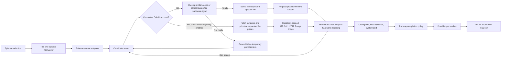

# Architecture

## Stack decision

Use Flutter for the application shell and `media_kit`/libmpv for one
device-agnostic Android playback path.

| Concern | Choice | Why |
| --- | --- | --- |
| TV UI | Flutter Material primitives plus a custom focus layer | Full control over a branded 10-foot UI, with primary flows designed and regression-tested for remote focus. |
| TV navigation | `Focus`, `FocusTraversalGroup`, `Shortcuts`, and `Actions` | Predictable D-pad behavior governed by the [TV navigation contract](TV_NAVIGATION_CONTRACT.md), without depending on the deprecated Android Leanback UI library. |
| Video | `media_kit`/libmpv with libass | One player handles web, Debrid, content URIs, private libraries, styled ASS, and unusual codecs consistently. |
| State | Riverpod | Testable feature-scoped state and dependency injection. |
| Routing | `go_router` | Declarative home, detail, auth, and player navigation. |
| HTTP | Dio for application APIs; libmpv for playback | Typed/cancelable API boundaries plus range requests and scoped library/debrid headers passed to the selected media. |
| Secrets | `flutter_secure_storage` | Android Keystore-backed storage for user tokens. |
| Local state | SQLite (`sqflite`, WAL mode) | Exact resume, history, per-series settings, compatibility failures, catalog cache, and performance events. |
| Native TV | Kotlin method channel | MediaSession, Watch Next, reminders, codec/display/audio capabilities, content-URI permissions, and display mode selection. |
| Metadata | AniList GraphQL with mapped Kitsu and Jikan fallbacks | AniList remains canonical; two independent account-free backups provide bounded read-only coverage when identity and requested filters can be preserved, and otherwise fail safely. |
| Auth | Direct Real-Debrid device OAuth plus a tracker pairing broker | Real-Debrid exposes a TV-friendly device flow; AniList/MAL authorization is adapted by a small server so secrets never ship in the APK. |
| Debrid | Real-Debrid, TorBox, AllDebrid, and Premiumize APIs | Magnets are processed remotely and only provider-generated HTTPS streams reach the player. |
| Direct torrent | libtorrent4j 2.1.0-38 behind an Android loopback Range server | Optional peer playback without a Debrid account; disabled by default, ARM-only, capability-scoped, and cleaned up with the player lease. |

Flutter remains responsible for catalog, account, stream-resolution, and TV
navigation UI. Full-screen video is hosted by media_kit's Android libmpv
surface integration. The same player widget, track model, recovery policy,
and remote HUD are used for every supported source class.

## Module boundaries

```text
lib/
  app/                       app composition and routes
  core/
    config/                  compile-time, non-secret configuration
    theme/                   visual tokens
    tv/                      focus and remote input primitives
    platform/                Android TV native bridge
    storage/                 SQLite state and history
    diagnostics/             redacted support export and correlated playback
                             session timelines
  features/
    auth/                    pairing broker client and secure token handoff
    catalog/                 AniList metadata, mapped Kitsu/Jikan outage
                             fallbacks, and domain models
    home/                    TV shelves and hero presentation
    player/                  MPV playback,
                             resume, diagnostics, and remote controls
    streaming/               user-configured sources plus debrid resolvers
    tracking/                MAL/AniList list and mutation contracts
```

Each integration sits behind a domain interface. UI code must not know whether
a release came from a local provider adapter, a hosted resolver, or a test
fixture.

## Playback pipeline



Important implementation rules:

- Normalize AniList titles, synonyms, season number, episode number, release
  group, resolution, codec, and batch status before ranking results.
- Real-Debrid no longer documents its former instant-availability endpoint.
  Add the magnet, select the matching file, and use torrent status/progress;
  cached entries normally reach `downloaded` almost immediately.
- A batch must select only the matching video file. MPV exposes
  embedded audio/subtitle tracks; MPV/libass can also use Matroska font
  attachments and full ASS styling.
- Keep debrid and source-provider API code outside widgets.
- Treat an unrestrict URL as short-lived and never persist it in logs.
- Direct torrent playback binds only to `127.0.0.1`, requires an unguessable
  per-session path, supports HEAD and single byte-range requests, and blocks
  until requested pieces pass verification. The bridge never logs or returns
  a magnet, peer endpoint, selected filename, or capability URL in diagnostics.
- A direct session may use at most a 6 GiB selected video plus 256 MiB free
  space, rejects ambiguous multi-file packs, and deletes its temporary cache
  when playback closes, startup is cancelled, the app task is removed, or the
  user clears cache.
- Direct playback owns one process-lifetime native engine because the pinned
  libtorrent4j release has an unsafe shutdown race. Closing a lease removes the
  active torrent/listener, disables DHT and all peer transports, and pauses the
  engine. A failed removal permanently poisons that engine until process
  restart so a stale torrent can never resume.
- Emit playback progress locally. Queue a tracking mutation after natural
  completion or a configurable threshold (for example, 85-90%), and make the
  mutation idempotent so retries cannot decrease progress.
- Keep the tracking outbox locally until both the provider response and local
  state agree.

Only index and stream material the user is legally permitted to access. Source
adapter terms and AniList API terms must be reviewed before public
distribution.

## Player behavior in this foundation

Normal playback starts in MPV. Adaptive MediaCodec decoding is used when the
device supports the stream, while release metadata and runtime watchdogs move
H.264 Hi10P, unsupported profiles, black-video failures, or persistently
choppy playback to MPV software decoding. The same player records checkpoints,
publishes MediaSession state, exposes track selection, and tries ranked source
alternatives without changing engines.

The TV control layer remains remote-first:

- D-pad arrows: reveal and navigate the focusable control row; they never seek
  while a control has focus.
- Center/Enter/K: activate the focused control or play/pause from the player
  root.
- J/L or media rewind/fast-forward: seek 10 seconds and show a trickplay
  preview when the device permits frame capture.
- S: cycle subtitles; M/gamepad Y: open playback options; A/gamepad X: cycle
  picture fit; C: engage software compatibility decoding.
- Back: return through normal Android navigation.

Do not infer successful video from audio progress alone. Preserve the latest
checkpoint whenever a stream or decoder mode changes.
Validate HEVC 10-bit, AV1, Dolby/DTS licensing behavior, H.264 Hi10P software
performance, and ASS-heavy samples on physical target boxes; emulator success
is not enough for codec certification.

## ABI and device policy

Playback policy is capability-driven rather than tied to a manufacturer or
model name. Runtime diagnostics report `Build.SUPPORTED_ABIS`, Android API
level, memory class, low-RAM status, selected decoder, codec, resolution, frame
rate, surface readiness, and dropped frames. Buffering and fallback decisions
use those capabilities and observed playback behavior.

Release builds support the Android TV/Fire TV ABI matrix:

- `armeabi-v7a` for 32-bit TV application runtimes, including many Fire TV
  models;
- `arm64-v8a` for 64-bit Android TV, Google TV, and Shield-class devices;
- `x86_64` for Android TV/Google TV emulators.

Public releases use one universal APK containing `armeabi-v7a` and
`arm64-v8a`, so users never need to select an ABI. `x86_64` remains available
for debug/emulator builds only. CPU marketing names are not sufficient: a
device with a 64-bit CPU can still expose only a 32-bit app ABI.

The optional direct-torrent engine is available only on `armeabi-v7a` and
`arm64-v8a`. Its pinned upstream Android artifacts target API 24. ARM64 is
16 KiB page-aligned; the upstream ARM32 binary is only 4 KiB-aligned, so its
runtime capability fails closed on ARM32 devices with larger page sizes. The setting
cannot be enabled on an unsupported ABI, and every release must re-check
16-KiB APK/ELF page alignment before claiming Android 15/16 compatibility.
